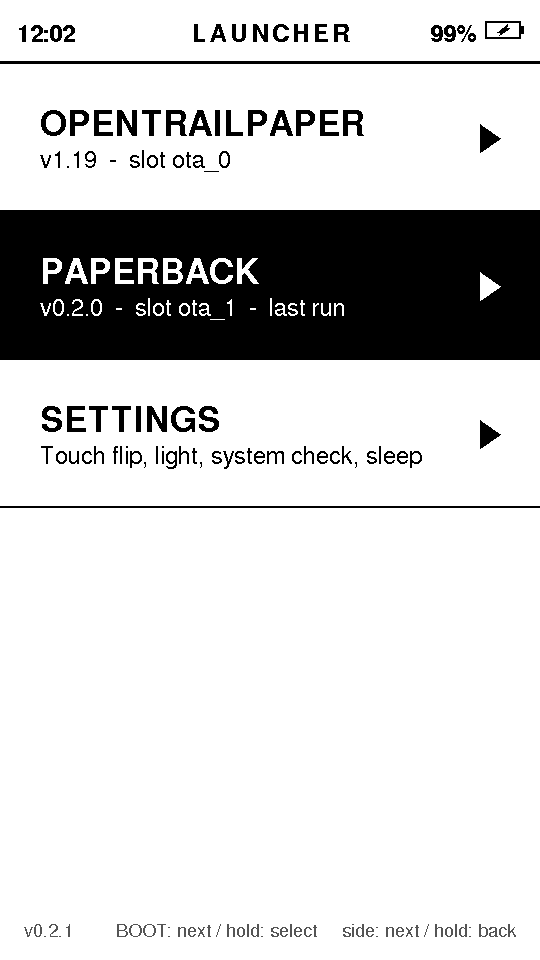
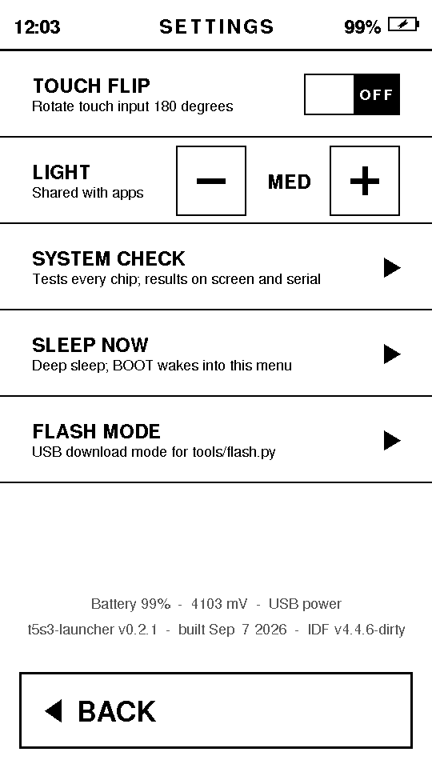
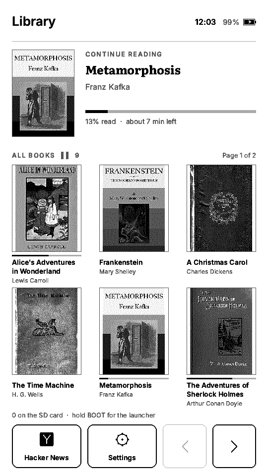

# t5s3-launcher

A launcher for running several firmwares on one **LilyGO T5S3 4.7" e-paper PRO**
(ESP32-S3, 16 MB flash, 8 MB PSRAM). The launcher sits in the flash's `factory`
partition and shows a menu on the e-paper; each app lives in its own OTA slot
and is a normal, independent firmware. Pick an app on screen, it boots; hold the
side button through a reset, you are back in the menu.

<p align="center">
  
  
  
  
</p>
<p align="center"><sub>Launcher home, launcher settings, Paperback's library, Paperback reading — read off the
panel's framebuffer with <code>tools/flash.py screenshot</code>, so these are the pixels on the glass.</sub></p>

Apps today:

* **[OpenTrailPaper](https://opentrailpaper.com)** — the DIY e-paper bike
  computer: offline maps, GPX routes, FIT recording, Bluetooth sensors, iOS and
  Android companions. Its site has a feature tour and a Web Serial flasher.
  Upstream is [RaemondBW/OpenTrailPaper](https://github.com/RaemondBW/OpenTrailPaper);
  here it is a fork with a ~40-line port (`apps/opentrailpaper`, branch
  `launcher`).
* **Paperback** — an e-book reader: embedded sample books with their cover art,
  `.txt` books from the SD card, and Hacker News over Wi-Fi
  ([`apps/paperback`](apps/paperback/README.md)).
* **System check** — built into the launcher: every chip on the board, results
  on screen and over serial.

## How it works

The stock ESP32 bootloader picks the `factory` partition whenever the OTA data
is blank, and an OTA slot otherwise. The launcher starts an app by pointing the
OTA data at its slot and restarting. The app, as the first line of `setup()`,
calls `launcher::handoff()`, which registers itself and blanks the OTA data
again — so every cold boot passes through the launcher, which shows its menu
(there is no autostart; you pick the app), while deep-sleep wakes fast-boot the
app directly and never see the launcher. Details and the verified bootloader facts:
[docs/boot-flow.md](docs/boot-flow.md).

```
0x000000 bootloader      0x010000 factory  = launcher (3 MB)
0x008000 partition table 0x310000 ota_0    = OpenTrailPaper (6 MB)
0x009000 nvs             0x910000 ota_1    = Paperback (6 MB; also OpenTrailPaper's update target)
0x00E000 otadata         0xF10000 storage  (896 KB)   0xFF0000 coredump (64 KB)
```

## Setup

```sh
uv tool install --python 3.13 platformio     # if you do not have pio
brew install esptool                          # optional; tools/flash.py brings its own
git clone --recursive git@github.com:krzysztoff1/t5s3-launcher.git
cd t5s3-launcher && tools/bootstrap.sh
```

## First install on a blank board

```sh
(cd launcher && pio run)
(cd apps/opentrailpaper && pio run -e t5s3-launcher)
(cd apps/paperback && pio run)

tools/flash.py system     # once: bootloader + partition table + launcher
tools/flash.py app ota_0 apps/opentrailpaper/.pio/build/t5s3-launcher/firmware.bin \
    --name OpenTrailPaper --version v1.19
tools/flash.py app ota_1 apps/paperback/.pio/build/app/firmware.bin \
    --name Paperback --version v0.2.0 --boot
```

`tools/flash.py` handles both of the board's USB personalities (the launcher's
USB-Serial-JTAG and OpenTrailPaper's USB-OTG), so no BOOT/RESET presses are
needed. `tools/flash.py --help` lists the rest: `ports`, `cmd`, `boot` (starts
an app and streams its boot log), `follow`, `syscheck`, `screenshot`, `monitor`.

## Build the latest version and install it

Plug the board in with a data cable, then:

```sh
export PATH="$HOME/.local/bin:$PATH"                 # where `uv tool install` put pio
git pull --recurse-submodules
git submodule update --init --recursive              # the OpenTrailPaper fork and LilyGO board support
tools/bootstrap.sh                                   # safe to re-run: vendor symlink, PlatformIO packages

(cd launcher && pio run)                                # -> launcher/.pio/build/launcher/firmware.bin
(cd apps/opentrailpaper && pio run -e t5s3-launcher)    # -> apps/opentrailpaper/.pio/build/t5s3-launcher/firmware.bin
(cd apps/paperback && pio run)                          # -> apps/paperback/.pio/build/app/firmware.bin

tools/flash.py ports                                    # the board, and which firmware is answering
tools/flash.py launcher                                 # factory slot only; apps and settings stay
tools/flash.py app ota_0 apps/opentrailpaper/.pio/build/t5s3-launcher/firmware.bin \
    --name OpenTrailPaper --version v1.19
tools/flash.py app ota_1 apps/paperback/.pio/build/app/firmware.bin \
    --name Paperback --version v0.2.0 --boot
```

Notes:

* **Board not listed by `ports`?** An app in deep sleep is off the USB bus:
  press BOOT to wake it, or re-seat the cable, then retry (the tool stops with
  "no Espressif USB device found" rather than waiting). Once the board answers,
  the tool asks a running app to reboot into download mode itself and never
  needs the BOOT/RESET combination.
* **Flash only what changed.** Each command rewrites one slot. `launcher` blanks
  the OTA data too, so the device comes back in the menu. `app` writes the slot,
  resets, registers the name and version shown in the menu, and with `--boot`
  starts the app and streams its console for 30 s (`--follow SEC` changes that;
  read it for errors).
* **Version strings** come from `FIRMWARE_VERSION` in
  `apps/opentrailpaper/src/config.h` and `APP_VERSION` in
  `apps/paperback/platformio.ini`; pass what you built.
* **Check the result:** `tools/flash.py cmd "ver"` prints the version of
  whatever is running, `tools/flash.py cmd "list"` (in the launcher) shows both
  slots with their labels, and `tools/check-sync.sh` confirms the shared files
  are identical across the apps before you build.
* **Wi-Fi for Paperback's Hacker News** is stored on the device, not in the
  repo: `tools/flash.py cmd 'wifi "network" "password"'` while Paperback runs,
  or a `/paperback/wifi.txt` on the SD card (two lines). It survives reflashing.
* **Screenshots** are real: `tools/flash.py screenshot shot.png` asks whatever
  is running for its framebuffer over the console and writes it as a 540x960
  four-level PNG. The launcher, Paperback and `apps/_template` answer; the
  encoder is the shared `launcher::dumpScreen()` in `launcher_api.h`, so a new
  app gets the command by copying one line from the template. OpenTrailPaper
  does not — it keeps epdiy's 4bpp landscape framebuffer, which this does not
  read.
* A flash that fails midway: [docs/recovery.md](docs/recovery.md).

## Buttons

The board has three physical buttons:

| Button | Where | Wired to | In the launcher | In OpenTrailPaper | In Paperback |
|---|---|---|---|---|---|
| **BOOT** | the main key on the case | GPIO 0 | short press: next item, hold: select; wakes from sleep | hold: power dialog (Shut down); wakes from sleep | next page; hold 1 s: back to the launcher; wakes from sleep |
| **Side button** | the second key on the case edge (LilyGO's `BUTTON`, on the IO expander) | XL9555 IO12 | next item, hold: back; **hold through a RESET to force the menu** | unused | previous page |
| **RST** | small reset button on the back | chip EN | hardware reset | hardware reset | hardware reset |

The front light is one setting for the whole device: change it in the launcher's
Settings screen, in OpenTrailPaper's settings or in Paperback's menu and the
others follow.

Holding BOOT while pressing RST puts the chip in USB download mode; that is the
ROM's rule, which is why the *side* button is the menu key.

## Getting back to the launcher

* **From the device:** hold the side button, press and release RST, keep holding
  until the menu shows. Works whether OpenTrailPaper is running or asleep.
* **From the Mac:** `tools/flash.py cmd "launcher"` while OpenTrailPaper or
  Paperback runs. Paperback also goes back when BOOT is held for a second.

## Shutting down

Both firmwares use deep sleep; the board has no power switch and unplugging USB
changes nothing, the battery keeps running what is on screen.

* **In OpenTrailPaper:** hold BOOT until its power dialog opens, tap *Shut down*.
  It draws a farewell screen and sleeps; BOOT wakes it straight back into
  OpenTrailPaper (the launcher is not involved on a wake). It also does this by
  itself after its idle timeout.
* **In the launcher:** tap *Sleep*, or leave it idle five minutes on battery.
  BOOT wakes it into the menu.

## Using it

* **Menu**: the home screen lists the app slots; tap one to start it. Every
  target is at least 88 px tall. BOOT short-press moves a highlight, BOOT held
  selects; the side button moves it, held it goes back; the capacitive key
  below the glass also goes back.
* **Settings**: a second screen behind the *Settings* row holds the touch flip,
  the shared front light, the system check, sleep and flash mode; the battery
  reading and build string sit at its foot. Flash mode asks first.
* **No autostart**: every boot lands in the menu; an app starts only when you
  tap it (or run `tools/flash.py boot <slot>`). A crashing app therefore just
  drops you back in the menu, which notes the crash reason.
* **System check**: a Settings row, or `tools/flash.py syscheck` from the Mac.
* **Screenshot**: `tools/flash.py screenshot shot.png` writes what is on the
  glass right now; `tools/flash.py cmd "menu settings"` puts the Settings
  screen up first if that is the one you want.

## Adding apps

See [docs/adding-an-app.md](docs/adding-an-app.md) — install any image with
`tools/flash.py app`, or copy `apps/_template`. Working with Claude Code? The
repo's `CLAUDE.md` is the runbook, and `/install-app`, `/new-app`,
`/device-check` are ready-made prompts.

## Status

Running on a board since 2026-09-06: install, menu, touch, OpenTrailPaper and
Paperback hand-back, and the system check (every peripheral PASS) verified.
Paperback verified the same day: library with cover art, reading, Hacker News
over Wi-Fi with the clock set by NTP, and the shared front light between the
launcher and the apps. The screenshots above came off the board itself on
2026-09-07 with `tools/flash.py screenshot`. Not yet exercised: the crash-loop pause,
side-button-through-RESET, deep-sleep wake into the menu and Paperback's
sleep/wake. See [docs/recovery.md](docs/recovery.md) if a flash goes wrong.

## Layout

```
partitions.csv          shared flash layout (single source of truth)
launcher_api/           header apps include
launcher/               the launcher firmware (PlatformIO)
apps/opentrailpaper/    submodule: fork, branch `launcher`
apps/paperback/         the e-book reader (fonts, sample books and covers under assets/)
apps/_template/         starting point for a new app
tools/                  flash.py, check-sync.sh, bootstrap.sh
docs/                   boot-flow, hardware, adding-an-app, recovery, img/ (screenshots)
vendor/                 submodule: LilyGO board support + drivers
```

## Licenses

Launcher and Paperback code: MIT. [OpenTrailPaper](https://opentrailpaper.com)
is Apache-2.0 (its own LICENSE in the submodule); EPD_Painter, SensorLib,
XPowersLib, RadioLib, PNGdec, JPEGDEC and the LilyGO board support keep their
own licenses. Paperback embeds the Literata and Inter fonts (SIL Open Font
License), stb_truetype (public domain) and public-domain texts and covers from
Project Gutenberg and Wolne Lektury.
