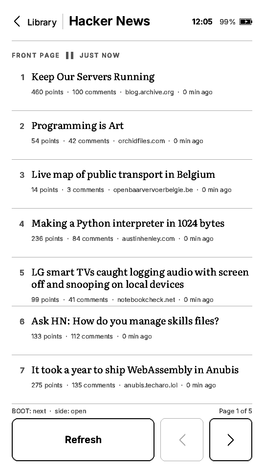

# Paperback

An e-book reader for the LilyGO T5S3 4.7" e-paper PRO, running as an app under
t5s3-launcher. Plain-text books with real typography, remembered reading
positions, generated covers, and a Hacker News reader over Wi-Fi.

<p align="center">
  
  
  
</p>
<p align="center"><sub>Off the panel itself with <code>../../tools/flash.py screenshot</code>, not mock-ups.</sub></p>

```sh
export PATH="$HOME/.local/bin:$PATH"
pio run
../../tools/flash.py app ota_1 .pio/build/app/firmware.bin --name Paperback --version v0.2.0 --boot
```

## What it does

* **Library.** Nine public-domain books are embedded in the image (Project
  Gutenberg and Wolne Lektury, see `assets/books/`); more come from `.txt`
  files in `/books` (or the root) of the SD card. Each book shows its cover
  art (the publisher's cover, embedded as a small greyscale PNG and dithered
  to the panel's four greys on the device), a progress bar, and the hero card
  at the top continues the last book. Books without art get a generated
  typographic cover.
* **Reader.** Text is laid out with vector fonts (Literata for body text, Inter
  for the interface, both SIL OFL) rasterised on the device by stb_truetype and
  quantised to the panel's four grey levels. Hard-wrapped Gutenberg text is
  reflowed into justified paragraphs with first-line indents, verse keeps its
  line breaks, `_emphasis_` becomes italics, chapter headings are detected and
  start a new page, and the whole book is paginated so page numbers are exact.
  The footer shows page, percent, chapter ticks and the time left in the book
  (from your measured pace).
* **Controls.** Everything you can tap is at least 88 px tall. On a page, tap
  the right two thirds (or swipe left) for the next page, the left third for
  the previous one, the top band for the menu, or hold a finger anywhere for
  the menu; BOOT turns forward, the side button back; hold BOOT for a second to
  return to the launcher. List screens (library, chapters, Hacker News) keep
  their pager and secondary actions in a bar of large buttons along the
  bottom, and the header's back label is a full-height target. The menu has
  chapters, a progress strip you can tap to jump (with "back to page N"),
  "Text & display" settings on two tabs - Text (font, size, spacing, margins,
  alignment, with a live preview) and Device (page turn quality, refresh
  interval, sleep timer, time zone, front light, plus a card with battery,
  storage and network status) - a manual panel refresh and sleep. The front
  light has four steps shared with the launcher and OpenTrailPaper through
  `launcher::setFrontLight()`, so it is set once for the whole device. The
  capacitive Home key below the glass goes back one screen (not yet verified
  on hardware; every screen has an on-screen way back too).
* **Sleep.** After the idle time (default 10 min, never while on USB) the page
  stays on the glass with a small sleep note in the footer; BOOT wakes back to
  the same page in about a second. Progress and settings live in NVS.
* **Hacker News.** The Hacker News button in the library's bottom bar opens the front page (official
  ranking, details from the Algolia API). A story shows its article, fetched as
  plain text through the `r.jina.ai` reader proxy, or its comment thread; both
  are read with the same paginated reader. Wi-Fi credentials come from the
  console (`wifi "ssid" "password"`) or `/paperback/wifi.txt` on the SD card
  (two lines: network, password). Connecting also syncs the RTC over NTP in the
  configured time zone, so the clock in the header becomes right.

## Layout of the project

| Path | What |
|---|---|
| `src/main.cpp` | `launcher::handoff()` first, then bring-up and the loop. |
| `src/app.cpp`, `src/app_hn.cpp` | Screens and input: library, reader, menu, settings, chapters, end, hint; Hacker News list/story/Wi-Fi help. |
| `src/layout.*` | Page composition and whole-book pagination. `compose()` and `render()` share one code path, so page numbers match what is drawn. |
| `src/textmodel.*` | Plain text → paragraphs (body, verse, H1/H2, subtitle, separator) and the chapter list. |
| `src/font.*` | stb_truetype faces, glyph cache in PSRAM, four-level quantisation. |
| `src/library.*`, `src/settings.*` | Book list (embedded + SD), progress and preferences in NVS. |
| `src/hn.*`, `src/json.h`, `src/html.*` | Wi-Fi, HTTPS fetches, a pull JSON parser, HN comment HTML → text. |
| `src/display.*`, `src/hwio.*` | EPD_Painter owner and primitives; buttons, touch, gauge, RTC, light, sleep. |
| `assets/fonts/` | Subset TTFs produced by `tools/build_fonts.py`. |
| `assets/covers/`, `src/covers.*` | Cover PNGs from `tools/fetch_covers.py`; PNGdec (vendored in `lib/PNGdec`, see its VENDORED.md) and the vendor JPEGDEC decode them into a PSRAM cache. |
| `assets/books/`, `src/builtin_books.h` | Sample texts and their table, produced by `tools/prep_books.py`. |
| `test/host/run.sh` | Host build of the model + paginator over the sample books; checks determinism and that no words are lost. |

## Adding books

Copy UTF-8 `.txt` files to `/books/` on the SD card. Name them
`Author - Title.txt` for the shelf to show both; Project Gutenberg headers are
read for title and author and the boilerplate is skipped. Up to 64 books, up to
6 MB each (SD books are loaded into PSRAM when opened). A cover is picked up
from a file with the same name and a `.png`, `.jpg` or `.jpeg` extension
(any size; 5:7 looks best, big JPEGs are decoded at reduced scale).

To change the embedded samples edit the `BOOKS` list in `tools/prep_books.py`
and `COVERS` in `tools/fetch_covers.py`, run `fetch_covers.py` then
`prep_books.py` (both need the network the first time), and update the
`board_build.embed_files` list in `platformio.ini`.

## Console

`help list open <n> next prev page <n> goto <pct> menu library hn refresh
light <0-3> size <0-6> font serif|sans wifi ... time gamma status screenshot
sleep launcher bootloader reboot ver` — `tools/flash.py cmd "status"` from the
repo root talks to it, and `tools/flash.py screenshot page.png` turns the
`screenshot` dump into a PNG of the current page.

## Known limits

* Plain text only (no EPUB); no hyphenation.
* Article text depends on the `r.jina.ai` service (20 requests/min without a key);
  TLS is used without certificate validation.
* Touch cannot wake the device from deep sleep; only the BOOT button can.
